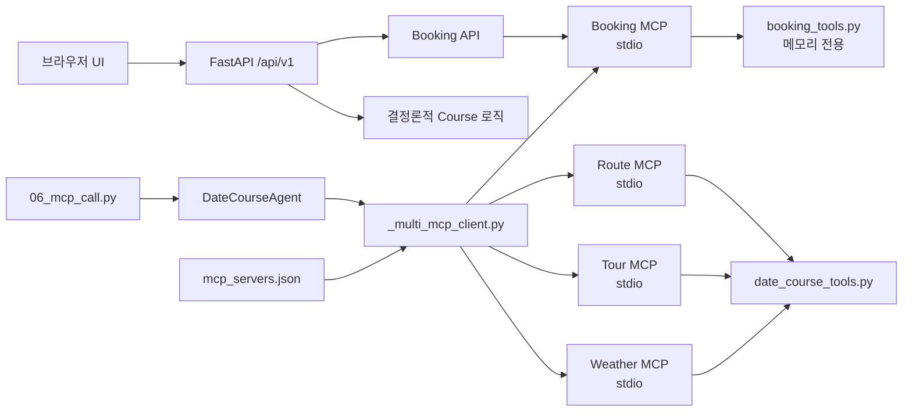

# Courseful MCP 여행 코스 플래너

## 공개 웹 데모

**배포 URL:** https://courseful-date-agent-demo.onrender.com  
**독립 배포 저장소:** https://github.com/cyb3rmaya/courseful-date-agent-demo

`plan.md`의 코스 입력·Timeline·장소 카드·검증·부분 재계획 흐름을 브라우저에서
확인할 수 있도록 FastAPI 단일 서비스 웹 데모를 제공합니다.

```text
web_app.py
├─ static/index.html
├─ static/styles.css
├─ static/app.js
├─ mcp_servers.json
├─ weather_mcp_server.py
├─ tour_mcp_server.py
├─ route_mcp_server.py
├─ booking_mcp_server.py
├─ booking_tools.py
└─ date_course_tools.py
```

로컬 실행:

```powershell
cd .\courseful-date-agent-demo
pip install -r requirements-deploy.txt
uvicorn web_app:app --host 127.0.0.1 --port 8000
```

확인 주소:

```text
웹 화면  http://127.0.0.1:8000
상태 확인 http://127.0.0.1:8000/health
API 문서  http://127.0.0.1:8000/docs
```

### 무료 배포 결정

| 구성 | 선택 | 이유 |
| --- | --- | --- |
| Python 웹 서버 | Render Free Web Service | 이 저장소의 FastAPI 배포 기준과 일치 |
| DB/Auth | 사용하지 않음 | 저장할 사용자 데이터가 없어 Supabase는 현재 불필요 |
| Redis | 사용하지 않음 | Session/Queue가 없어 Upstash는 현재 불필요 |
| LLM | 공개판에서 비활성화 | 공개 API Key 비용 악용을 막고 무료 상태 유지 |
| UI | FastAPI 정적 파일 | 별도 Streamlit 서버 없이 한 개의 무료 서비스로 공개 |

배포 설정은 저장소 루트의 `render.yaml`에 있습니다. Render Free는 일정 시간 요청이
없으면 Sleep 상태가 되므로 첫 접속이 느릴 수 있습니다. 공개 웹은
`deterministic_mock` 모드이며 입력을 저장하지 않습니다. 실제 OpenAI + MCP Agent는
공개 웹과 분리된 `06_mcp_call.py`로 실행합니다.

### Tour MCP 계획 통합

`tour_mcp_plan_package.zip`의 관광 Tool 계약을 먼저 기존 서버에 통합했고, 이후 멀티
MCP 과제 요구에 맞춰 같은 도메인 함수를 재사용하는 독립 Tour MCP Adapter로
분리했습니다. 기존 `date_course_mcp_server.py`는 이전 예제와 테스트의 호환용입니다.

```text
get_tourist_attractions(city, categories, limit)
→ 부산/서울 및 관광 유형 Schema 검증
→ local-tour-catalog에서 명소와 place_id 반환
→ get_place_details / calculate_route에 같은 place_id 전달
→ validate_course로 일정·예산·필수 조건 검증
```

- Agent에 관광 전용 분기를 추가하지 않고 `tools/list` 자동 발견을 유지합니다.
- 관광 Tool 결과에 없는 명소 정보를 최종 결과에 임의로 추가하지 않습니다.
- 운영시간·가격처럼 바뀌는 값은 관광 카탈로그에서 확정하지 않습니다.
- 공개 UI는 관광 유형, 명소 설명, 검증 동선을 한 화면에 함께 표시합니다.

### 멀티 MCP + Booking 과제 구현

`mcp_servers.json`이 실행할 서버 목록을 소유합니다. Agent 코드에는 서버별 `if/else`
분기를 두지 않습니다. `_multi_mcp_client.py`가 설정을 읽어 네 stdio 프로세스를 같은
수명 주기에서 열고, `tools/list` 결과로 Tool 이름과 서버를 매핑합니다.

| 서버 | 역할 | Tool |
| --- | --- | --- |
| `weather` | 날씨 조회 | `get_weather` |
| `tour` | 관광·장소 조회 | `get_tourist_attractions`, `search_places`, `get_place_details`, `search_date_context` |
| `route` | 경로·예산·검증 | `calculate_route`, `estimate_course_budget`, `validate_course` |
| `booking` | 예약 액션 | `prepare_booking`, `confirm_booking`, `get_booking_status` |

동시 연결 확인:

```powershell
python .\07_multi_mcp_check.py
```

정상 출력은 서버 4개와 Tool 11개를 보여줍니다. 확인되지 않은 예약을 막기 위해 검사
스크립트는 `prepare_booking`까지만 호출하고 `confirm_booking`은 실행하지 않습니다.

Booking 서버는 외부 예약사, 결제, DB INSERT를 호출하지 않습니다. 초안 token은 같은
입력에 대해 동일하게 만들어지고, `user_confirmed=true`일 때만 프로세스 메모리의
상태를 모의 확정합니다. stdio의 `stdout`은 JSON-RPC 전용이므로 과제에서 요구한
`print` 동작 확인은 UTF-8 `stderr` 로그로 구현했습니다.



#### stdio와 원격 HTTP

| 구분 | stdio | Streamable HTTP |
| --- | --- | --- |
| 프로세스 | Client가 로컬 자식 프로세스를 실행 | MCP 서버가 독립 서비스로 실행 |
| 연결 범위 | 같은 머신의 학습·개발 환경에 적합 | 다른 서버·공장·지역의 서비스 연결 가능 |
| 주소 | 실행 명령과 파일 경로 | `https://service.example/mcp` 같은 endpoint |
| 필수 운영 요소 | 프로세스 수명·stderr 로그 | TLS, 인증·권한, Origin 검증, rate limit, 관측성 |

과제에서 말한 HTTP(SSE)의 원격 연결 취지는 맞습니다. 현재 MCP 표준은 stdio와
Streamable HTTP를 표준 전송으로 정의하며, Streamable HTTP가 2024-11-05 버전의
기존 HTTP+SSE 전송을 대체했습니다. SSE는 Streamable HTTP 응답 스트리밍에 선택적으로
사용될 수 있습니다. 공식 명세: https://modelcontextprotocol.io/specification/2025-06-18/basic/transports

현재 과제는 외부 액션을 열지 않기 위해 네 서버를 로컬 stdio로 실행합니다. Booking을
원격 배포할 때는 단순히 `0.0.0.0`에 공개하지 않고 사용자 인증, Tool별 권한,
멱등성 저장소, 감사 로그, Origin 검증을 먼저 추가해야 합니다.

#### 프론트엔드 연동

현재 정적 UI가 이미 `POST /api/v1/course-plans`와 `POST /api/v1/bookings`를 호출하며,
Booking API는 JSON 레지스트리에서 `booking` 서버만 선택해 실제 stdio MCP Tool을
호출합니다.
React/Next.js로 교체해도 이 HTTP 계약은 그대로 유지할 수 있습니다. 예약 패널은 사용자가
모의 실행임을 체크해야 활성화되며 확인 ID와 `actual_side_effect: false`를 표시합니다.

### UI 적용 기준

- Wanderlog: 일정과 지도/명소를 한 화면에서 비교하는 정보 구조
- GitHub Primer: 명확한 카드 경계, 상태 배지, 점진적 상세 공개
- GOV.UK Design System: 상대 단위 글자 크기, 굵은 위계, 작은 화면 가독성
- 브랜드 화면이나 오픈소스 코드를 복제하지 않고 패턴과 원칙만 재구성
- 외부 폰트 없이 한국어 시스템 글꼴을 사용하고 모든 소스 파일을 UTF-8로 유지

## Agent 실행 파일 묶음

```text
06_mcp_call.py
└─ ai_agent.py
   └─ _multi_mcp_client.py
      ├─ mcp_servers.json
      ├─ weather_mcp_server.py
      ├─ tour_mcp_server.py
      ├─ route_mcp_server.py
      └─ booking_mcp_server.py
```

- `06_mcp_call.py`: 복합 데이트 요청을 받아 단일 DateCourseAgent를 실행하는 진입점
- `ai_agent.py`: Tool 선택, 오류 fallback, 최대 2회 국소 재계획, 구조화 출력 담당
- `_multi_mcp_client.py`: JSON 설정 기반 멀티 stdio 연결, 중복 Tool 검출과 호출 라우팅
- `mcp_servers.json`: 서버 실행 명령과 활성화 상태를 코드 밖에서 관리
- `*_mcp_server.py`: 도메인별 Tool을 노출하는 얇은 MCP Adapter
- `booking_tools.py`: 확인·멱등성을 강제하는 외부 쓰기 없는 예약 로직
- `date_course_tools.py`: Mock Provider와 결정론적 예산·Validator 구현

기존 `01_first_mcp_server.py`부터 `05_mcp_tool_loop.py`까지는 MCP의 발견/호출
원리를 단계적으로 설명하는 학습 예제로 그대로 유지합니다. 06번은 그 구조를
`plan.md`의 DateCourseAgent 계약으로 확장한 예제입니다.

```powershell
python .\06_mcp_call.py
python .\06_mcp_call.py "서울에서 가족 3명이 12시부터 18시까지 걷기 적은 실내 코스를 짜 줘. 예산은 12만원이야."
```

### 06번 PLAN 계약

```text
자연어 요청
→ DateCourseAgent가 Hard Constraint / Soft Preference 분리
→ 필요한 MCP Tool만 선택
→ 날씨 / 관광 명소 / 장소 / 상세 / 경로 / 의미 맥락 조회
→ 결정론적 예산 계산
→ validate_course
→ 실패 Stop만 교체(정상 Stop의 place_id는 Agent가 보호)
→ 최대 2회 재검증
→ Structured Output Contract 반환
```

현재 장소·날씨·의미 맥락은 외부 Provider 선정 전 단계의 Mock 데이터이며 모든
결과에 `source`와 `fetched_at`을 포함합니다. Agent 출력에도 Mock 사용 경고가
표시됩니다. 비용 합계, 시간/영업시간/이동/도보/Hard Constraint 검사는 LLM이
추론하지 않고 `date_course_tools.py`가 결정론적으로 수행합니다.

관련 테스트는 저장소 루트에서 다음을 사용합니다.

```powershell
pytest .\tests -q
```

MCP는 Tool과 Context를 특정 Agent 코드에 직접 묶지 않고, Client가 발견하고 호출할
수 있는 공통 규약으로 제공합니다. 이 단원은 기존 `03_tool-use`의 여행 Tool을 작은
MCP Server로 옮기며 차이를 확인합니다.

```text
Tool Use: Agent → Python 함수 직접 호출
MCP:      Host/Client → MCP Server 발견 → Tool 호출 → 결과 사용
```

## Tool Use와 MCP stdio 구분

Tool은 날씨 조회나 호텔 검색처럼 **실제로 수행할 기능**입니다. MCP는 Tool 그 자체가
아니라 Tool·Resource·Prompt를 Client에 제공하고 호출하기 위한 **통신 규약**입니다.
`stdio`는 MCP Client와 Server가 그 규약의 메시지를 주고받는 **전송 방식**입니다.

```text
Tool  = 무엇을 실행할 것인가
MCP   = 기능을 어떻게 설명·발견·호출할 것인가
stdio = MCP 메시지를 어떤 통로로 주고받을 것인가
```

따라서 `get_current_weather()` 함수는 Tool이고, `tools/list`와 `tools/call`은 MCP가
정한 호출 방식이며, `stdin`과 `stdout`은 이 예제에서 선택한 전송 통로입니다.

| 구분 | 기존 Tool Use | MCP + stdio |
| --- | --- | --- |
| 기능 구현 | Python 함수 | 동일한 Python 함수 |
| Tool 위치 | Agent 또는 Backend 코드 내부 | 별도 MCP Server 프로세스 |
| Tool 등록 | Agent 코드가 Schema를 직접 보유 | Server가 Tool과 Schema를 공개 |
| Tool 발견 | 미리 작성한 목록 사용 | Client가 `tools/list` 요청 |
| Tool 실행 | Python 함수 직접 호출 | Client가 `tools/call` 요청 |
| 통신 | 같은 프로세스의 함수 호출 | JSON-RPC 메시지를 stdin/stdout으로 교환 |
| 서버 실행 | 별도 서버 없음 | Client가 자식 프로세스로 자동 실행 |
| 포트 | 사용하지 않음 | 사용하지 않음 |
| 수명 | Backend와 같음 | Client 연결이 끝나면 자식 프로세스도 종료 |
| 재사용 범위 | 해당 애플리케이션에 결합 | MCP Client를 지원하는 Host에서 재사용 가능 |
| Context 제공 | 애플리케이션마다 직접 구현 | Resources·Prompts라는 공통 기능 사용 가능 |

두 방식 모두 LLM이 함수를 직접 실행하는 것은 아닙니다. LLM은 Tool 이름과
arguments를 제안하고, 실제 실행 여부와 권한은 Backend 또는 MCP Server가
검증합니다.

### stdio 실행 흐름

```text
사용자 질문
→ Host가 사용할 Tool 판단
→ MCP Client가 Python Server 프로세스 실행
→ initialize로 기능 협상
→ tools/list로 Tool과 Schema 발견
→ tools/call로 이름과 arguments 전달
→ MCP Server가 검증 후 Python Tool 실행
→ Tool Result 반환
→ Host가 최종 답변 생성
→ Client 종료와 함께 Server 프로세스 종료
```

stdio는 설치된 로컬 Tool을 연결하기 단순하고 네트워크 포트를 열지 않는다는 장점이
있습니다. 반면 Client마다 Server 프로세스를 실행하므로 여러 Backend가 하나의 원격
서버를 공유하거나 독립적으로 배포하는 구조에는 적합하지 않습니다. 그런 경우에는
다음 Mini Agent 프로젝트처럼 Streamable HTTP를 사용합니다.

## 핵심 구성

| 파일 | 확인할 내용 |
| --- | --- |
| `01_first_mcp_server.py` | Tool과 Resource를 제공하는 stdio MCP Server |
| `02_list_and_call_tools.py` | 서버 자동 실행, 초기화, Tool 발견과 호출 |
| `03_read_resource.py` | Tool이 아닌 읽기 전용 Context 조회 |
| `04_validation_and_errors.py` | Schema 검증 오류가 Tool Result로 돌아오는 과정 |
| `05_mcp_tool_loop.py` | GPT → 여러 MCP Tool 선택·호출 → LLM 최종 답변 |

이 예제에서 MCP Server는 별도 터미널이나 포트를 요구하지 않습니다. Client가 Python
자식 프로세스로 서버를 실행하고 `stdin`/`stdout`으로 JSON-RPC 메시지를 교환합니다.
Client가 종료되면 서버 프로세스도 함께 종료됩니다.

## 준비

저장소 루트에서 가상환경을 활성화하고 의존성을 설치합니다.

```powershell
cd .\courseful-date-agent-demo
.\.venv\Scripts\Activate.ps1
pip install -r requirements-deploy.txt
```

MCP Python SDK는 안정적인 v1 API를 사용하도록 `mcp>=1.27,<2`로 제한합니다.

## 실행

서버 파일을 단독 실행하면 stdio 입력을 기다리므로 화면에 아무것도 출력되지 않는
것이 정상입니다. 학습할 때는 Client 예제를 실행합니다.

```powershell
python .\02_list_and_call_tools.py
python .\03_read_resource.py
python .\04_validation_and_errors.py
python .\05_mcp_tool_loop.py
```

`05_mcp_tool_loop.py`는 OpenAI Responses API를 사용합니다. 과정 루트의 `.env`에
API Key와 Function Calling 지원 모델을 설정합니다.

```env
OPENAI_API_KEY=발급받은_API_KEY
OPENAI_MODEL=gpt-4.1-mini
```

05번의 실제 실행 흐름은 다음과 같습니다.

```text
MCP tools/list
→ MCP Tool Schema를 OpenAI Function Tool 형식으로 변환
→ OpenAI Responses API
→ GPT가 Tool 이름과 arguments 제안
→ 허용된 MCP Tool인지 검사
→ MCP tools/call
→ function_call_output을 call_id와 함께 GPT에 전달
→ 두 번째 GPT 호출에서 Tool 없이 최종 답변 생성
```

교육용 여행 데이터가 지원하는 도시는 `부산`, `서울`입니다. MCP Tool의 `city`
Schema도 두 값의 enum으로 제한해 GPT가 다른 도시를 제안하면 Server 검증에서
거부합니다. 출력 Trace의 `tool`, `arguments`, `is_error`를 함께 확인합니다.

## Tool과 Resource

| 구분 | 용도 | 이 예제 |
| --- | --- | --- |
| Tool | 계산, 조회, 변경처럼 실행이 필요한 기능 | `get_current_weather`, `search_hotels` |
| Resource | URI로 식별하는 읽기 전용 Context | `travel://policy/baggage` |

Tool 설명과 arguments Schema는 서버가 제공하고 Client는 `list_tools()`로 발견합니다.
Client는 서버의 Python 함수를 직접 import하지 않고 `call_tool()`로 실행합니다.

## 안전 경계

- Tool arguments는 서버의 타입 힌트에서 만들어진 Schema로 검증합니다.
- Client가 보내는 Tool 이름과 arguments를 신뢰하지 않습니다.
- stdio 서버는 표준 출력에 임의 로그를 쓰지 않습니다. 로그는 프로토콜 메시지와
  충돌할 수 있습니다.
- API Key 같은 환경변수는 필요한 값만 MCP 자식 프로세스에 전달합니다.
- 실제 예약·결제처럼 상태를 바꾸는 Tool은 사용자 확인 단계를 별도로 둡니다.

## 다음 단계

현재 공개판은 한 개의 무료 Render 서비스 안에서 Booking MCP를 stdio 자식 프로세스로
호출합니다. 물리적으로 분리할 때는 각 원격 MCP에 인증·Origin 검증·HTTPS를 추가하고
Streamable HTTP 전송으로 바꾼 뒤, 같은 `mcp_servers.json` 레지스트리에 등록합니다.

## 공식 문서

- [MCP Python SDK](https://github.com/modelcontextprotocol/python-sdk)
- [MCP Transport](https://modelcontextprotocol.io/specification/2025-11-25/basic/transports)
- [MCP Resources](https://modelcontextprotocol.io/specification/2025-11-25/server/resources)
