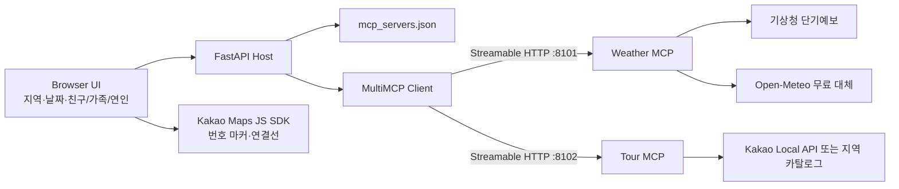

# 03 MCP — Weather + Tour 나들이 코스

친구·가족·연인 중 한 유형을 고르면 날씨를 확인하고 명소 세 곳을 한 지도에 연결하는 공개 웹 앱입니다. 사용자 입력은 **지역, 날짜, 동행 유형** 세 가지이며 가격·호텔·복잡한 시나리오 선택은 없습니다.

## 활성 구성

| Server | 기본 URL | 제공 Tool | 현재 웹 흐름 |
| --- | --- | --- | --- |
| Weather MCP | `http://127.0.0.1:8101/mcp` | `get_current_weather`, `get_weather_forecast` | 두 Tool 모두 호출 |
| Tour MCP | `http://127.0.0.1:8102/mcp` | `search_hotels`, `search_spots` | `search_spots`만 호출 |

`search_hotels`는 “서버에 Tool을 더해 확장한다”는 강의 구조와 독립 호출 테스트를 위해 보존합니다. 공개 화면과 기본 Agent는 호텔이나 가격을 요청하지 않습니다. Route·Booking 서버와 과도한 시나리오 선택지는 활성 레지스트리 및 UI에 등록하지 않았습니다.



한 대에서 실행할 때는 FastAPI Host가 비어 있는 8101·8102 포트를 감지해 두 MCP를 자식 프로세스로 시작합니다. 두 컴퓨터로 분리할 때는 서버별 HTTPS 주소만 환경 변수로 바꿉니다.

```env
WEATHER_MCP_URL=https://weather-host.example/mcp
TOUR_MCP_URL=https://tour-host.example/mcp
```

Client와 Agent 코드는 URL 변경 외에는 동일합니다.

## 로컬 실행

```powershell
cd .\05_llm-agent-orchestration\03_mcp
pip install -r requirements-deploy.txt
uvicorn web_app:app --host 127.0.0.1 --port 8000
```

직접 두 서버를 띄우려면 별도 터미널에서 실행합니다.

```powershell
python weather_mcp_server.py --host 127.0.0.1 --port 8101
python tour_mcp_server.py --host 127.0.0.1 --port 8102
python 07_multi_mcp_check.py
```

- UI: `http://127.0.0.1:8000`
- API 문서: `http://127.0.0.1:8000/docs`
- 상태: `http://127.0.0.1:8000/health`

## 무료 데이터와 지도 설정

`.env.example`을 참고합니다. 키가 없거나 외부 Provider가 응답하지 않아도 앱은 출처와 경고를 표시하고 무료 대체 데이터로 동작합니다.

### 기상청

1. Chrome에서 [기상청 단기예보 조회서비스](https://www.data.go.kr/data/15084084/openapi.do)를 엽니다.
2. 활용 신청 후 일반 인증키(Decoding)를 확인합니다.
3. `.env`의 `KMA_SERVICE_KEY`에 저장하고 앱을 다시 시작합니다.

기상청 호출이 실패하면 Open-Meteo로 전환합니다. 두 Provider 모두 실패할 때만 `local-weather-fallback`을 반환하며 실제 데이터처럼 숨기지 않습니다.

### Kakao 지도와 명소

1. Chrome에서 [Kakao Developers 앱 콘솔](https://developers.kakao.com/console/app)을 엽니다.
2. JavaScript 키를 `KAKAO_JAVASCRIPT_KEY`에 설정합니다.
3. 로컬 주소와 공개 배포 주소를 JavaScript SDK 허용 도메인에 등록합니다.
4. 실시간 장소 검색도 필요하면 REST API 키를 `KAKAO_REST_API_KEY`에 별도로 설정합니다.

JavaScript 키는 브라우저용 공개 식별자이므로 응답에 전달되며, 허용 도메인 제한이 필수입니다. REST API 키와 기상청 키는 브라우저에 보내지 않습니다.

## 웹 API

```http
POST /api/v1/trip-briefs
Content-Type: application/json

{
  "location": "부산",
  "date": "2026-08-28",
  "companion": "couple"
}
```

`companion`은 `friend`, `family`, `couple` 중 하나입니다. 응답은 날씨와 순서가 있는 `course.stops` 세 곳을 반환합니다.

```json
{
  "course": {
    "companion_label": "연인",
    "stop_count": 3,
    "stops": [{"sequence": 1}, {"sequence": 2}, {"sequence": 3}]
  },
  "mcp_execution": {
    "architecture": "two_independent_http_servers",
    "transport": "streamable_http",
    "servers_called": ["weather", "tour"],
    "parallel_server_calls": true,
    "trace": []
  }
}
```

## AI Agent

`06_mcp_call.py`는 `mcp_servers.json`의 두 서버에서 Tool을 발견하고 OpenAI Tool loop를 실행합니다.

```powershell
python 06_mcp_call.py "부산 내일 날씨를 보고 연인과 갈 명소 세 곳을 코스로 묶어줘"
```

CLI에만 `OPENAI_API_KEY`가 필요합니다. 공개 웹 앱은 유료 LLM 없이 결정론적으로 같은 MCP Tool을 호출하므로 무료 운영이 가능합니다.

## 검증

```powershell
pytest tests -q
```

검증 항목은 다음과 같습니다.

- 활성 서버가 Weather·Tour 두 개이며 모두 Streamable HTTP인지
- `tools/list`가 두 서버의 Tool 네 개를 발견하는지
- 공개 API가 실제로 현재 날씨·예보·명소 Tool 세 개를 호출하는지
- 친구·가족·연인에 따라 세 장소의 우선 순서가 달라지는지
- 가격·호텔 같은 이전 입력을 API가 거부하는지
- 한글, CSP, Kakao SDK 및 모바일 화면이 정상인지

## 배포 판단

- 저장해야 할 예약·사용자 데이터가 없으므로 Supabase는 사용하지 않습니다.
- 공개 UI와 두 로컬 MCP 프로세스는 하나의 Render Web Service 안에서 실행할 수 있어 무료 데모에 적합합니다.
- 무료 인스턴스는 유휴 후 첫 요청이 느릴 수 있습니다.
- 실제로 물리적인 두 컴퓨터에 배치하면 각 MCP를 HTTPS 서비스로 분리하고 인증, 접근 제어, rate limit, 관측 로그를 추가해야 합니다.

## 공식 참고

- [MCP Python SDK](https://github.com/modelcontextprotocol/python-sdk)
- [MCP Streamable HTTP 전송 명세](https://modelcontextprotocol.io/specification/2025-11-25/basic/transports)
- [기상청 단기예보 조회서비스](https://www.data.go.kr/data/15084084/openapi.do)
- [Open-Meteo Forecast API](https://open-meteo.com/en/docs)
- [Kakao 지도 Web API 가이드](https://apis.map.kakao.com/web/guide/)
