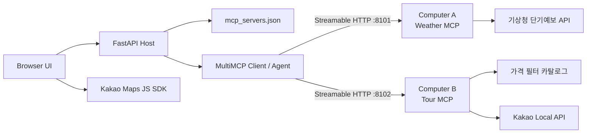

# 03 MCP — Weather + Tour / Streamable HTTP

현재 과제는 활성 MCP Server를 정확히 두 개로 제한합니다.

| Server | 기본 URL | Tool |
| --- | --- | --- |
| Weather MCP | `http://127.0.0.1:8101/mcp` | `get_current_weather`, `get_weather_forecast` |
| Tour MCP | `http://127.0.0.1:8102/mcp` | `search_hotels`, `search_spots` |

웹 앱의 입력은 지역, 여행 날짜, 호텔 1박 상한 세 가지뿐입니다. 기존 Route·Booking 서버와 많은 시나리오 선택지는 현재 활성 레지스트리와 UI에서 제거했습니다. 예전 stdio 학습 파일은 강의 단계 회귀 테스트를 위해 남아 있지만 `mcp_servers.json`에는 등록되지 않습니다.

## 구조



로컬·무료 Render 데모에서는 한 머신 안의 두 독립 포트로 실행합니다. 물리적인 두 컴퓨터로 분리할 때는 각각 서버 파일을 실행한 뒤 Host의 환경변수만 바꿉니다.

```env
WEATHER_MCP_URL=https://weather-host.example/mcp
TOUR_MCP_URL=https://tour-host.example/mcp
```

Client/Agent 코드는 URL 변경을 제외하면 동일합니다.

## 로컬 실행

```powershell
cd .\05_llm-agent-orchestration\03_mcp
pip install -r requirements-deploy.txt
uvicorn web_app:app --host 127.0.0.1 --port 8000
```

웹 앱은 비어 있는 8101·8102 포트를 감지해 두 MCP 서버를 자식 프로세스로 시작하고 FastAPI lifespan 동안 재사용합니다.

두 서버를 직접 확인하려면 터미널 두 개를 사용합니다.

```powershell
python weather_mcp_server.py --host 127.0.0.1 --port 8101
python tour_mcp_server.py --host 127.0.0.1 --port 8102
```

세 번째 터미널에서 실제 `tools/list`와 네 Tool 호출을 확인합니다.

```powershell
python 07_multi_mcp_check.py
```

웹 주소:

- UI: `http://127.0.0.1:8000`
- API 문서: `http://127.0.0.1:8000/docs`
- 상태: `http://127.0.0.1:8000/health`

## 무료 실데이터 연결

`.env.example`을 참고해 환경변수를 설정합니다. 키는 저장소에 커밋하지 않습니다.

### 기상청

1. Chrome에서 공공데이터포털의 [기상청 단기예보 조회서비스](https://www.data.go.kr/data/15084084/openapi.do)를 엽니다.
2. 활용신청 후 마이페이지에서 일반 인증키(Decoding)를 확인합니다.
3. `KMA_SERVICE_KEY`에 해당 인증키를 설정합니다.
4. Weather MCP를 재시작합니다.

현재 날씨는 초단기실황, 날짜 날씨는 단기예보를 우선 호출합니다. 기상청 키가 없거나 응답 장애가 생기면 키가 필요 없는 Open-Meteo 실데이터로 자동 전환하며 `source`와 경고에 전환 사실을 표시합니다. 두 Provider가 모두 실패할 때만 `provider_status: fallback`, `source: local-weather-fallback`을 반환합니다. 폴백을 실데이터처럼 표시하지 않습니다.

### Kakao 지도와 명소

1. Chrome에서 [Kakao Developers 앱 콘솔](https://developers.kakao.com/console/app)을 엽니다.
2. 앱을 만들고 Kakao Map 사용 설정을 켭니다.
3. JavaScript 키에 `http://127.0.0.1:8000`과 공개 배포 URL을 SDK 허용 도메인으로 등록합니다.
4. `KAKAO_JAVASCRIPT_KEY`에는 JavaScript 키를 설정합니다.
5. Tour MCP의 실시간 장소 검색도 쓰려면 `KAKAO_REST_API_KEY`에 REST API 키를 별도로 설정합니다.

JavaScript 키는 브라우저 SDK에 전달되는 공개 플랫폼 키이므로 네트워크에서 보입니다. 보안 경계는 키 은닉이 아니라 Kakao 콘솔의 허용 도메인 제한입니다. REST API 키와 기상청 키는 브라우저 응답에 포함하지 않습니다.

## 웹 API

```http
POST /api/v1/trip-briefs
Content-Type: application/json

{
  "location": "부산",
  "date": "2026-08-28",
  "max_hotel_price": 150000
}
```

응답에는 `weather`, `hotels`, `spots`와 함께 다음 실행 증거가 포함됩니다.

```json
{
  "mcp_execution": {
    "architecture": "two_independent_http_servers",
    "transport": "streamable_http",
    "servers_called": ["weather", "tour"],
    "parallel_server_calls": true,
    "trace": []
  }
}
```

## AI Agent

`06_mcp_call.py`는 `mcp_servers.json`에서 서버를 읽고 `tools/list`로 네 Tool을 발견한 뒤 OpenAI Tool loop를 수행합니다.

```powershell
python 06_mcp_call.py "부산의 현재 날씨와 내일 예보, 15만원 이하 호텔과 명소를 찾아줘"
```

CLI에만 `OPENAI_API_KEY`가 필요합니다. 공개 웹 앱은 유료 LLM 없이 동일한 네 MCP Tool을 결정론적으로 호출하므로 무료 운영이 가능합니다.

## 검증

```powershell
pytest tests -q
```

현재 핵심 검증 항목:

- 활성 서버가 Weather·Tour 두 개뿐인지
- 전송 방식이 모두 Streamable HTTP인지
- `tools/list` 결과가 네 Tool과 정확히 일치하는지
- 15만원 상한 필터가 실제 결과 가격에 적용되는지
- 웹 요청이 두 서버를 호출하고 실행 trace를 반환하는지
- 한국어 파일과 UI에 Unicode 대체문자가 없는지

## 배포 판단

- DB/Auth/예약 상태가 없으므로 Supabase는 사용하지 않습니다.
- 공개 UI와 Host는 기존 Render Free Web Service 한 개를 사용합니다.
- 무료 데모에서는 두 MCP 프로세스를 같은 Render 인스턴스의 localhost 포트로 운영합니다.
- 두 물리 서버가 필수인 운영 환경에서는 Weather와 Tour를 각 HTTPS 서비스로 배포하고 URL 환경변수로 연결해야 합니다. 이 경우 서비스 수와 보안 운영 비용이 늘어납니다.
- 외부 MCP를 공개할 때는 TLS, 인증·권한, Host/Origin 검증, rate limit, 관측 로그를 추가해야 합니다. 현재 localhost child-server 구성은 공개 MCP endpoint가 아닙니다.

## 공식 참고

- [MCP Python SDK](https://github.com/modelcontextprotocol/python-sdk)
- [MCP Streamable HTTP 전송 명세](https://modelcontextprotocol.io/specification/2025-11-25/basic/transports)
- [기상청 단기예보 조회서비스](https://www.data.go.kr/data/15084084/openapi.do)
- [Open-Meteo Forecast API](https://open-meteo.com/en/docs)
- [Kakao 지도 Web API 가이드](https://apis.map.kakao.com/web/guide/)
