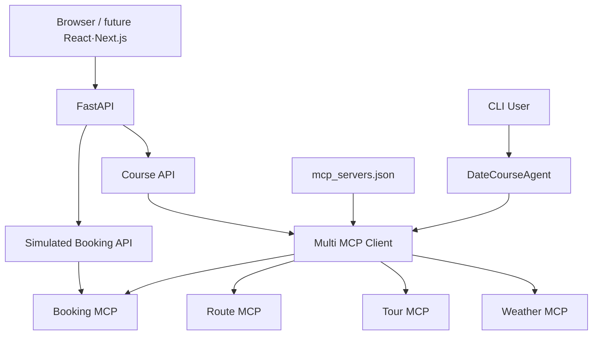

# PLAN.md — Context-Aware Date Course AI Agent

> **프로젝트 주제명**  
> **상황 인지형 맞춤 데이트·동행 코스 추천 AI 에이전트**  
> **Context-Aware Date Course AI Agent**
>
> 커플·가족·친구 등 동행 유형과 사용자의 취향, 예산, 시간, 이동수단, 날씨, 영업 여부, 이동거리 같은 복합 조건을 종합해 **AI Agent가 필요한 Tool을 선택하고**, 실제 실행 가능한 코스를 **계획 → 검증 → 부분 수정 → 재검증**하는 서비스.

---

## 0. 최종 비판 전면 재검토 결과

이 PLAN은 기존 초안을 그대로 확장하지 않고 아래 3개 기준으로 전면 재검토했다.

### 검토 기준

1. **레퍼런스 정합성**
   - Google Maps, NAVER Map, Airbnb, Booking.com, Tripadvisor 등 서비스 규모와 사용성이 검증된 대형 서비스의 UX 패턴을 1차 기준으로 삼는다.
   - Wanderlog처럼 일정·지도 결합에 특화된 서비스는 2차 보조 레퍼런스로 사용한다.
   - 오픈소스는 공식 문서와 저장소를 기준으로 실제 구현 가능성을 검토한다.

2. **논리성**
   - 단순 검색/추천을 AI Agent라고 부르지 않는다.
   - LLM이 해야 할 판단과 일반 코드가 해야 할 계산을 분리한다.
   - RAG, 외부 API, Tool, Agent의 역할을 중복시키지 않는다.
   - 동적 데이터와 정적/의미 데이터를 분리한다.
   - 실패 시 전체를 다시 만드는 방식이 아니라 문제가 있는 부분만 교체한다.

3. **최초 프롬프트와의 일치성**
   - 복합 요구를 Agent가 판단해야 한다.
   - Agent가 상황에 따라 Tool을 선택한다.
   - 공통 Tool과 도메인 전용 Tool을 구분한다.
   - 중간에 사용자가 매 단계 선택해야만 진행되는 고정 Workflow로 만들지 않는다.
   - 전체 갈아엎기가 아니라 부분 피드백 루프를 유지한다.

---

## 0.1 기존 계획에서 수정한 핵심 사항

### 수정 1 — 모든 것을 Agent 판단으로 만들지 않는다

기존 초안은 날씨, 예산, 시간, 검증까지 모두 Agent가 처리하는 것처럼 보일 수 있었다.

이를 다음과 같이 수정한다.

```text
LLM / Agent가 잘하는 것
- 사용자의 자연어 요구 해석
- Hard Constraint / Soft Preference 분리
- 어떤 Tool이 필요한지 판단
- 후보들 사이의 트레이드오프 판단
- 추천 순서/코스 구성
- 검증 실패 원인을 보고 어떤 대안을 다시 찾을지 결정

일반 코드가 더 잘하는 것
- 가격 합계
- 이동시간 합계
- 시간 겹침 검사
- 영업시간 범위 검사
- 거리 임계값 검사
- 필수 필드 존재 여부
- Validation Rule 실행
```

**원칙:**  
> 계산 가능한 것은 계산하고, 판단이 필요한 것은 Agent에게 맡긴다.

---

### 수정 2 — RAG에 실시간 데이터를 저장하지 않는다

RAG에는 다음과 같은 정보가 적합하다.

```text
적합
- 분위기
- 대화하기 좋은 정도
- 가족 친화도
- 사진 촬영 적합성
- 활동성
- 로맨틱함
- 비 오는 날 체감 적합성
- 소개팅/커플/가족/친구별 맥락
- 편집자가 작성한 장소 특징 설명
- 후기에서 추출한 의미적 특징
```

반대로 다음은 기본적으로 RAG 원본 사실로 사용하지 않는다.

```text
부적합
- 오늘 영업시간
- 현재 휴무 여부
- 오늘 가격
- 현재 날씨
- 현재 교통시간
- 현재 혼잡도
```

이 정보는 가능한 경우 **실시간 Tool/API 결과**로 가져온다.

RAG 문서에 과거 데이터를 보조 정보로 넣는 경우에도 반드시:

```text
source
collected_at
last_verified_at
freshness
```

메타데이터를 저장한다.

---

### 수정 3 — MapLibre를 무조건 기본 지도 기술로 고정하지 않는다

한국 장소 검색/경로/API와 실제 통합성을 우선한다.

```text
지도 렌더링 후보
- 국내 지도 SDK
- MapLibre GL JS

장소 데이터
- 국내 장소 검색 API
- 별도 장소 Provider

경로 데이터
- 사용 가능한 국내 Route Provider
```

MapLibre는 강력한 오픈소스 렌더러지만, **장소 검색 데이터·타일·경로 데이터까지 자동으로 제공하는 것은 아니다.**

따라서 기술 선택은 다음 기준으로 확정한다.

1. 국내 장소 검색 품질
2. 경로/대중교통 지원
3. API 사용 조건
4. 지도 UI 커스터마이징 필요성
5. 비용/쿼터
6. 라이선스
7. 팀 구현 난이도

---

### 수정 4 — 내부 Tool을 모두 HTTP API로 노출하지 않는다

사용자용 API와 Agent 내부 Tool은 구분한다.

```text
사용자용 API
- 코스 생성
- 코스 조회
- 특정 장소 교체
- Agent 실행 상태

Agent 내부 Tool
- 날씨 조회
- 장소 검색
- 상세 조회
- 경로 계산
- RAG 검색
- 예산 계산
- 코스 검증
```

필요하면 Tool을 MCP Server로 노출하지만, 프론트엔드가 각 Tool을 직접 호출하는 구조는 기본안으로 사용하지 않는다.

---

### 수정 5 — Multi-Agent는 MVP에서 제외

MVP는:

```text
1개의 DateCourseAgent
+
여러 개의 Tool
+
결정론적 Validator
```

로 만든다.

Multi-Agent는 다음 조건이 충족될 때만 2차 확장한다.

- 단일 Agent 프롬프트가 과도하게 복잡해짐
- 서로 독립적인 책임 분리가 명확함
- Agent 간 전달 비용보다 이점이 큼
- 평가에서 Multi-Agent가 실제 개선을 보임

---

# 1. 프로젝트 핵심 정의

## 1.1 한 문장 정의

> 사용자의 관계·취향·예산·시간·이동 조건과 날씨·영업시간·이동거리 같은 외부 정보를 종합하여, AI가 필요한 Tool을 선택하고 실행 가능한 데이트/동행 코스를 계획·검증·부분 재계획하는 상황 인지형 AI Agent.

---

## 1.2 프로젝트가 해결하는 문제

기존 장소 추천 서비스는 흔히 다음 구조다.

```text
지역 입력
→ 장소 검색
→ 결과 목록
→ 사용자가 직접 조합
```

본 프로젝트는 사용자가 직접 모든 조건을 비교하고 코스를 조립하는 부담을 줄인다.

```text
복합 자연어 요구
→ 요구 구조화
→ 필요한 데이터 판단
→ Tool 실행
→ 후보 비교
→ 코스 구성
→ 현실성 검증
→ 실패 지점만 재검색
→ 최종 코스
```

---

# 2. “AI Agent가 필요한 주제인가?” 판별

## 2.1 Agent가 필요 없는 요청

```text
"부산 오늘 날씨 알려줘"
```

이 요청은 Weather Tool 1회 호출로 해결 가능하다.

Agent가 필요 없다.

---

## 2.2 Agent가 필요한 요청

```text
"토요일에 여자친구랑 부산에서 데이트하고 싶어.
차는 없고 1인당 7만원 정도야.
비가 오면 실내가 좋고, 많이 걷는 건 싫어.
카페와 야경은 좋아하지만 회는 싫어."
```

필요한 판단:

- 날짜 해석
- 동행 유형
- 예산
- 이동수단
- 날씨
- 음식 제외 조건
- 장소 분위기
- 도보량
- 영업시간
- 장소 간 이동시간
- 시간 배치
- 전체 예산
- 날씨 변경 시 대안
- 특정 장소 실패 시 대체 장소

여러 데이터 소스를 종합해 결론을 만들어야 하므로 Agent가 적합하다.

---

# 3. 핵심 성공 조건

이 프로젝트가 성공했다고 판단하기 위한 핵심 조건은 다음과 같다.

## Agent 관점

- [ ] 입력에 따라 호출하는 Tool이 달라진다.
- [ ] 모든 요청에서 무조건 동일한 Tool 순서를 실행하지 않는다.
- [ ] LLM이 실시간 정보를 추측하지 않는다.
- [ ] Tool 결과를 근거로 추천한다.
- [ ] 최종 코스 전에 Validation을 수행한다.
- [ ] Validation 실패 시 문제가 있는 부분만 재계획한다.
- [ ] 무한 Replan을 방지한다.

## UX 관점

- [ ] Chat만 있는 화면이 아니다.
- [ ] Map + Timeline + Place Card가 연결된다.
- [ ] 지도 Marker와 Course Card 선택 상태가 동기화된다.
- [ ] Agent의 사용자용 진행 상태를 보여준다.
- [ ] “왜 추천했는지”를 짧고 명확하게 설명한다.
- [ ] 특정 장소만 교체할 수 있다.
- [ ] 모바일에서 Bottom Sheet 패턴으로 자연스럽게 전환된다.
- [ ] Loading / Error / Empty / Partial Success 상태가 존재한다.

---

# 4. 지원 동행 유형

## MVP

| 유형 | 코드 | 주요 판단 축 |
|---|---|---|
| 커플 | `couple` | 분위기, 사진, 로맨틱, 대화 |
| 가족 | `family` | 이동 편의, 휴식, 가족 친화, 식사 |
| 친구 | `friends` | 활동성, 재미, 가격, 그룹 적합 |

## 2차 확장

| 유형 | 코드 |
|---|---|
| 소개팅/썸 | `dating` |
| 부모님 | `parents` |
| 아이 동반 | `family_with_kids` |
| 지인/비즈니스 | `acquaintance` |

---

# 5. 사용자 요구 모델

## 5.1 Hard Constraints

위반하면 안 되는 조건.

예:

```text
- 예산 상한
- 특정 음식 알레르기/강한 제외
- 운영시간
- 시작/종료 시간
- 이동수단
- 특정 지역 범위
- 실내만 가능
```

## 5.2 Soft Preferences

가능하면 만족시키는 조건.

```text
- 야경 선호
- 사진 찍기 좋은 곳
- 조용한 곳
- 카페 선호
- 감성적인 분위기
- 걷는 거리 최소화
```

## 5.3 Agent가 먼저 해야 할 일

자연어를 다음처럼 구조화한다.

```json
{
  "companion_type": "couple",
  "location": "부산",
  "date": "2026-08-29",
  "start_time": "14:00",
  "end_time": "22:00",
  "party_size": 2,
  "budget_per_person": 70000,
  "transportation": "public_transport",
  "hard_constraints": {
    "avoid_food": ["회"],
    "max_walking_level": 2
  },
  "soft_preferences": [
    "cafe",
    "night_view",
    "romantic"
  ]
}
```

---

# 6. 정보 부족 질문 정책

Agent가 질문을 너무 많이 하면 일반 설문 Workflow가 된다.

따라서 질문은 **최종 추천 가능 여부에 영향을 주는 핵심 정보가 없을 때만** 한다.

## 질문해야 하는 경우

```text
지역 자체가 없음
날짜/시간이 필수인데 알 수 없음
예산이 핵심인데 매우 제한적인 요청
인원 수가 비용 계산에 필수
사용자의 표현이 서로 모순
```

## 질문하지 않아도 되는 경우

```text
분위기 세부 옵션이 없음
카페 종류가 없음
사진 선호 정도가 없음
```

이 경우 기본값/일반 추천을 사용하고 최종 응답에서 가정을 명시한다.

---

# 7. 전체 아키텍처

```text
USER
 │
 ▼
Frontend
 │
 ▼
FastAPI
 │
 ▼
DateCourseAgent
 │
 ├── Intent / Constraint Parser
 │
 ├── Planning
 │
 ├── Tool Selection
 │
 ├── Candidate Ranking
 │
 └── Replanning Decision
 │
 ├──────────── Common Tools ─────────────┐
 │                                       │
 │   Weather        Place       Route    │
 │                                       │
 └───────────────────────────────────────┘
 │
 ├──────────── Domain Tools ─────────────┐
 │                                       │
 │ Date RAG    Budget     Validator       │
 │                                       │
 └───────────────────────────────────────┘
 │
 ▼
Validated Course
 │
 ▼
Map + Timeline + Explanation
```

---

# 8. Agent Orchestration 원칙

LangGraph 같은 상태 기반 오케스트레이션 도구를 사용할 경우에도 모든 노드를 LLM으로 만들지 않는다.

```text
START
 ↓
parse_request          [LLM or structured model]
 ↓
check_required_fields  [deterministic]
 ↓
plan_information_need  [LLM]
 ↓
tool_calls             [Tools]
 ↓
build_candidates       [deterministic + ranking]
 ↓
compose_course         [LLM]
 ↓
validate_course        [deterministic]
 ↓
valid?
 ├─ YES → finalize
 │
 └─ NO
      ↓
 classify_issue         [deterministic first]
      ↓
 select_replan_action   [LLM]
      ↓
 replace_failed_stops
      ↓
 validate_course
      ↓
 max_replan_count?
```

## 최대 Replan 횟수

MVP 기본값:

```text
MAX_REPLAN_COUNT = 2
```

2회 실패 시:

- 실패 이유
- 확인하지 못한 데이터
- 현재 가능한 최선안
- 사용자가 바꿀 수 있는 조건

을 보여준다.

---

# 9. Tool 설계 원칙

Tool은 “Agent가 생각하는 기능”이 아니라 **검증 가능한 외부 능력**으로 설계한다.

각 Tool은 최소 다음을 가져야 한다.

```text
name
description
input_schema
output_schema
timeout
error_code
source
fetched_at
```

Agent는 Tool 결과에 없는 사실을 만들어서는 안 된다.

---

# 10. 공통 Tool

## 10.1 `get_weather`

### 목적
지역/날짜의 날씨 정보를 확인한다.

### Input

```python
get_weather(
    location: str,
    date: str
)
```

### Output

```json
{
  "condition": "rain",
  "temperature_c": 25,
  "rain_probability": 80,
  "source": "weather_provider",
  "fetched_at": "..."
}
```

### Agent 사용 예

```text
강수확률이 높고 사용자가 비 오는 날 실내를 원함
→ 실내 후보 비중 증가
```

---

## 10.2 `search_places`

### 목적
지역/카테고리/키워드 기반 실제 장소 후보를 가져온다.

### Input

```python
search_places(
    query: str,
    location: str,
    radius_m: int | None,
    categories: list[str] | None
)
```

### Output

```json
{
  "places": [
    {
      "place_id": "...",
      "name": "...",
      "category": "cafe",
      "address": "...",
      "lat": 0,
      "lng": 0
    }
  ],
  "source": "place_provider",
  "fetched_at": "..."
}
```

---

## 10.3 `get_place_details`

### 목적
후보 장소의 실사용 가능성을 확인한다.

### 확인 대상

- 주소
- 좌표
- 카테고리
- 운영시간
- 가격 정보가 있는 경우
- 예약/공식 링크가 있는 경우
- Provider가 주는 품질 신호

### 주의

가격, 영업시간을 Provider가 제공하지 않는 경우 **추측하지 않는다.**

```json
{
  "opening_hours": null,
  "opening_hours_verified": false
}
```

처럼 반환한다.

---

## 10.4 `calculate_route`

### 목적
장소 간 이동 거리와 시간을 계산한다.

```python
calculate_route(
    origin,
    destination,
    transportation
)
```

### Output

```json
{
  "distance_m": 2300,
  "duration_min": 18,
  "walking_distance_m": 420,
  "transportation": "public_transport",
  "source": "route_provider"
}
```

---

# 11. Date Domain Tool

## 11.1 `search_date_context`

기존 `search_date_spots`를 더 명확한 역할로 변경한다.

RAG는 “실제 장소가 존재하는가?”보다 “이 장소가 어떤 상황에 어울리는가?”에 집중한다.

### Input

```python
search_date_context(
    companion_type,
    mood,
    preferences,
    constraints,
    candidate_place_ids=None
)
```

### 반환 예

```json
{
  "contexts": [
    {
      "place_id": "...",
      "semantic_tags": [
        "quiet",
        "romantic",
        "conversation"
      ],
      "scores": {
        "romantic": 4,
        "conversation": 5,
        "photo": 4
      },
      "source": "...",
      "last_verified_at": "..."
    }
  ]
}
```

---

## 11.2 `estimate_course_budget`

결정론적으로 계산한다.

```python
estimate_course_budget(
    stops,
    party_size,
    transport_costs
)
```

Output:

```json
{
  "known_total": 112000,
  "unknown_items": [
    "place_3_activity_price"
  ],
  "budget_limit": 140000,
  "within_known_budget": true
}
```

**중요:**  
모르는 가격을 LLM이 임의로 채우지 않는다.

---

## 11.3 `validate_course`

프로젝트의 핵심 결정론적 Tool.

### 검사 항목

```text
- 시간 순서
- 시작/종료 시간
- 운영시간
- 이동시간
- 이동거리
- 도보량
- 예산
- Hard Constraint
- 중복 장소
- 동일 카테고리 과다 반복
- 날씨 부적합
- 필수 데이터 누락
```

### Output

```json
{
  "valid": false,
  "errors": [
    {
      "code": "CLOSED_AT_VISIT_TIME",
      "stop_id": "stop_3",
      "message": "예정 방문 시간에 영업 여부를 충족하지 못함"
    }
  ],
  "warnings": [
    {
      "code": "PRICE_UNKNOWN",
      "stop_id": "stop_2"
    }
  ],
  "unknowns": []
}
```

---

# 12. Tool 분류 — 공통 vs 서비스 특화

## Common MCP Server 후보

```text
get_weather
search_places
get_place_details
calculate_route
```

다른 여행/외출 Agent에서도 재사용할 수 있다.

## Date Domain MCP Server 후보

```text
search_date_context
estimate_course_budget
validate_course
```

데이트/동행 서비스의 판단 기준과 연결된다.

---

# 13. MCP 적용 원칙

MCP는 목적이 아니라 **Tool 인터페이스 표준화 수단**으로 사용한다.

### 적용 이유

- Tool schema 표준화
- Agent와 Tool 구현 분리
- 공통 Tool 재사용
- 다른 Agent 확장 용이

### 금지

```text
MCP를 쓴다는 이유로
모든 함수와 DB를 별도 Server로 분리
```

MVP에서는 복잡도를 낮추기 위해:

```text
Tool Function
→ MCP Adapter
```

형태도 허용한다.

---

# 14. RAG 데이터 설계

## 14.1 RAG가 담당할 데이터

```text
place_id
place_name
companion_type
mood
activity_type
conversation_level
photo_level
romantic_level
family_friendly
activity_level
walking_level
rainy_day_fit
indoor_outdoor
semantic_description
source
source_type
collected_at
last_verified_at
```

---

## 14.2 예시

```json
{
  "place_id": "provider-place-id",
  "place_name": "OO 전시관",
  "companion_type": [
    "couple",
    "friends"
  ],
  "mood": [
    "quiet",
    "artistic"
  ],
  "activity_type": [
    "exhibition",
    "conversation",
    "photo"
  ],
  "conversation_level": 5,
  "photo_level": 4,
  "romantic_level": 4,
  "walking_level": 1,
  "rainy_day_fit": 5,
  "semantic_description": "실내 전시 공간으로 대화와 사진 중심의 일정에 적합...",
  "source": "curated_reference",
  "last_verified_at": "2026-08-20"
}
```

---

# 15. RAG 품질 관리

RAG가 많다고 좋은 것이 아니다.

## 데이터 수집 기준

- 실제 장소 ID와 연결 가능
- 출처 존재
- 의미 태그가 명확
- 중복 문서 제거
- 오래된 문서 표시
- 허위/과장 데이터 제거

## 평가

예:

```text
Query:
"비 오는 날 많이 걷지 않고 대화하기 좋은 커플 장소"

Expected tags:
rainy_day_fit >= 4
walking_level <= 2
conversation_level >= 4
companion_type contains couple
```

RAG 평가셋을 별도로 만든다.

---

# 16. 추천 및 점수 설계

LLM의 감으로 순위를 정하지 않는다.

## 예시 점수

```text
Preference Fit      30
Route Efficiency    20
Budget Fit          15
Weather Fit         15
Companion Fit       10
Time Fit            10
----------------------
Total              100
```

가중치는 초기값이며 테스트 후 조정한다.

---

## 16.1 Hard Constraint는 점수로 상쇄하지 않는다

예:

```text
사용자: 회 절대 안 먹음
```

회 전문 식당이 다른 점수가 높더라도 탈락한다.

```text
Hard Constraint → Filter
Soft Preference → Score
```

이 규칙을 유지한다.

---

# 17. 핵심 데이터 모델

## `UserIntent`

```text
session_id
companion_type
location
date
start_time
end_time
party_size
budget
transportation
hard_constraints
soft_preferences
assumptions
```

## `PlaceCandidate`

```text
place_id
name
category
lat
lng
provider
details
semantic_features
scores
freshness
```

## `CourseStop`

```text
stop_id
place_id
start_time
end_time
expected_cost
route_from_previous
recommendation_rationale
```

## `CoursePlan`

```text
course_id
stops
known_total_cost
unknown_costs
total_route_time
total_walking_distance
score
warnings
validation_status
```

## `ValidationIssue`

```text
code
severity
stop_id
message
suggested_action
```

---

# 18. Public API 설계

## 18.1 코스 생성

```http
POST /api/v1/course-plans
```

Request:

```json
{
  "message": "토요일 부산에서 여자친구랑 7만원 안에서..."
}
```

Response:

```json
{
  "course_id": "...",
  "status": "completed",
  "intent_summary": {},
  "course": {},
  "recommendation_rationale": [],
  "warnings": []
}
```

`recommendation_rationale`는 사용자에게 보여줄 간단한 추천 근거다.

내부 Chain-of-Thought를 반환하지 않는다.

---

## 18.2 특정 장소만 교체

```http
POST /api/v1/course-plans/{course_id}/replace-stop
```

Request:

```json
{
  "stop_id": "stop_3",
  "instruction": "식당만 더 저렴한 곳으로 바꿔줘"
}
```

원칙:

```text
stop_1 KEEP
stop_2 KEEP
stop_3 REPLACE
stop_4 KEEP
```

변경 후 전체 코스는 다시 검증한다.

---

## 18.3 코스 조회

```http
GET /api/v1/course-plans/{course_id}
```

---

## 18.4 Agent 진행 상태

선택사항:

```http
GET /api/v1/agent-runs/{run_id}/stream
```

SSE/Streaming으로 사용자용 상태만 전달한다.

예:

```text
요청 조건 분석
날씨 확인
후보 장소 탐색
이동시간 확인
코스 검증
```

---

# 19. 사용자에게 보여주지 않는 것

```text
Raw Chain-of-Thought
내부 Prompt 전체
Tool 인증정보
API Key
LLM 내부 토큰
민감한 시스템 로그
```

대신 보여주는 것:

```text
추천 이유
사용한 주요 조건
검증 결과
확인하지 못한 정보
출처/갱신 시점이 필요한 경우 메타데이터
```

---

# 20. 백엔드 폴더 구조 제안

```text
backend/
└── app/
    ├── main.py
    │
    ├── agents/
    │   ├── date_course_agent.py
    │   ├── state.py
    │   └── prompts.py
    │
    ├── graph/
    │   ├── date_course_graph.py
    │   └── nodes/
    │       ├── parse_request.py
    │       ├── plan_tools.py
    │       ├── compose_course.py
    │       ├── validate.py
    │       └── replan.py
    │
    ├── tools/
    │   ├── common/
    │   │   ├── weather_tool.py
    │   │   ├── place_search_tool.py
    │   │   ├── place_detail_tool.py
    │   │   └── route_tool.py
    │   │
    │   └── date/
    │       ├── date_context_tool.py
    │       ├── budget_tool.py
    │       └── course_validator_tool.py
    │
    ├── mcp/
    │   ├── common_server.py
    │   └── date_server.py
    │
    ├── rag/
    │   ├── repository.py
    │   ├── embeddings.py
    │   ├── retriever.py
    │   └── ingestion/
    │
    ├── routers/
    │   ├── course_router.py
    │   └── agent_run_router.py
    │
    ├── schemas/
    │   ├── intent.py
    │   ├── place.py
    │   ├── course.py
    │   └── validation.py
    │
    ├── services/
    │   ├── place_service.py
    │   ├── course_service.py
    │   └── scoring_service.py
    │
    └── core/
        ├── config.py
        ├── logging.py
        └── exceptions.py
```

---

# 21. 프론트엔드 목표

## 핵심 원칙

> ChatGPT 복제품이 아니라 **AI 대화 + 장소 Discovery + Map + Timeline + Replan UI**를 결합한다.

---

# 22. 대기업 UX 레퍼런스 우선순위

## 1차 레퍼런스

### Google Maps

참고 영역:

```text
Explore
Map Interaction
Place Selection
Saved Lists
지도와 장소 상세 연결
```

적용:

```text
Map Marker ↔ Place Card 동기화
탐색 중심 UI
장소 저장
선택 상태 명확화
```

---

### NAVER Map

국내 프로젝트에서 특히 높은 우선순위.

참고 영역:

```text
국내 장소 검색
발견
카테고리
저장
길찾기
지역 인기 장소
```

적용:

```text
한국 사용자가 익숙한 장소 탐색
카테고리 Chip
Map + Search Result
국내 위치 표현
```

---

### Airbnb

참고 영역:

```text
이미지 중심 Discovery
Experiences
AI Review Highlights
Shared Itinerary
지도 + 주변 장소 + 이동시간
```

적용:

```text
감성적인 Place Card
AI 추천 이유 요약
코스 일정과 장소를 함께 보여주는 UX
```

---

### Booking.com

참고 영역:

```text
Conversational AI Trip Planner
자연어 요구 refinement
AI Chat ↔ 기존 Visual UI 전환
시각적 결과 목록
조건 중심 탐색
```

적용:

```text
Chat only 금지
대화 결과를 Card/Map으로 즉시 시각화
조건 수정 시 결과 갱신
```

---

### Tripadvisor

참고 영역:

```text
AI Trip Planning
Saved Places
사용자 맞춤 추천
Trip 아이디어 정리
```

적용:

```text
추천 → 저장 → 코스 반영
```

---

## 2차 레퍼런스

### Wanderlog

대기업 우선 원칙은 유지하되, 다음 기능은 특화 서비스가 더 직접적인 참고가 된다.

```text
Itinerary + Map
장소 간 거리/시간
Route Optimization
Budget
일정 재정렬
```

---

# 23. 레퍼런스 적용 금지 원칙

참고해야 하는 것:

```text
Information Architecture
Interaction Pattern
Visual Hierarchy
Loading/Error Pattern
Map ↔ Card Interaction
Filter Pattern
Bottom Sheet Pattern
Itinerary Pattern
```

복사하면 안 되는 것:

```text
브랜드 로고
고유 색상 체계
아이콘 자산
CSS 그대로 복제
레이아웃 픽셀 단위 복제
문구 그대로 복제
```

목표는 “Airbnb처럼 보이게”가 아니라:

> 여러 검증된 UX 패턴을 프로젝트 목적에 맞게 재설계하는 것.

---

# 24. 화면별 레퍼런스 매핑

| 우리 화면/기능 | 1차 레퍼런스 | 2차 |
|---|---|---|
| Home | Airbnb | Booking.com |
| AI 입력 | Booking AI Planner | Tripadvisor |
| 장소 탐색 | NAVER Map | Google Maps |
| 지도 | Google Maps | NAVER Map |
| Place Card | Airbnb | 지도 서비스 카드 |
| Filter | Booking.com | NAVER Map |
| Saved | Google Maps | NAVER Map |
| Timeline | Airbnb Shared Itinerary | Wanderlog |
| Route | Google Maps | Wanderlog |
| Mobile Map | 대형 지도 앱 패턴 | Apple HIG 참고 |
| Replan | 자체 Agent UX | - |
| AI 추천 이유 | Airbnb AI 요약 패턴 | 자체 구현 |

---

# 25. Desktop UI

기본은 3-Panel.

```text
┌────────────────┬────────────────────┬─────────────────────────┐
│ AI / 조건      │ Course Timeline    │ Map                     │
│                │                    │                         │
│ 대화           │ 14:00 Cafe         │      1                  │
│ 조건 Chip      │ ↓ 15min            │                         │
│ Agent Status   │ 16:00 Exhibition   │              2          │
│                │ ↓                  │                         │
│                │ 18:30 Restaurant   │   3                     │
│                │ ↓                  │                         │
│                │ 20:30 Night View   │                4        │
└────────────────┴────────────────────┴─────────────────────────┘
```

권장 초기 비율:

```text
AI / Condition    24~28%
Timeline          28~32%
Map               나머지
```

해상도와 사용성 테스트 후 조정한다.

---

# 26. Mobile UI

3-Panel을 그대로 축소하지 않는다.

```text
MAP
+
Bottom Sheet
```

구조로 변경한다.

```text
┌──────────────────────┐
│ Search / Condition   │
│                      │
│        MAP           │
│    1        2        │
│          3           │
│                      │
├──────────────────────┤
│ ━━━━━                │
│ 오늘의 코스          │
│ 14:00 Cafe           │
│ 16:00 Exhibition     │
│ 18:30 Dinner         │
│                      │
│ [AI에게 수정 요청]   │
└──────────────────────┘
```

---

# 27. 핵심 UI Component

```text
DatePromptInput
CompanionSelector
PreferenceChips
ConstraintSummary
AgentProgress
MapCanvas
CourseMarker
PlaceCard
CourseTimeline
RouteSummary
RecommendationReason
WarningBadge
CourseBudgetSummary
ReplaceStopAction
MobileCourseSheet
EmptyState
ErrorState
Skeleton
```

---

# 28. AI 추천 이유 UI

단순히:

```text
추천점수: 93
```

으로 끝내지 않는다.

```text
광안리 OO 카페
AI 추천 적합도 93

추천 이유
- 커플 + 대화 중심 요청과 높은 적합도
- 실내 공간
- 이전 장소에서 대중교통/도보 이동 부담이 낮음
- 카페 선호 조건 반영

주의
- 가격 일부는 실시간 확인 불가
```

사용자에게 필요한 설명만 제공한다.

---

# 29. Agent Progress UI

Raw reasoning을 노출하지 않는다.

좋은 예:

```text
✓ 요청 조건 정리
✓ 날씨 확인
✓ 후보 장소 탐색
● 이동시간 및 예산 검증
○ 최종 코스 구성
```

나쁜 예:

```text
LLM 내부 추론 문장 전체
```

---

# 30. Partial Replan UX

사용자:

```text
"식당만 더 저렴한 곳으로 바꿔줘."
```

UI:

```text
1 Cafe        KEEP
2 Exhibition  KEEP
3 Dinner      REPLACING...
4 Night View  KEEP
```

교체 완료 후:

```text
3 NEW Dinner
- 기존 장소 대비 예상 비용 감소
- 전시관에서 이동 8분
- 영업시간 검증 완료
```

그리고 전체 Validator를 한 번 더 실행한다.

---

# 31. Frontend 오픈소스 전략

## 권장 Stack

```text
Next.js / React
TypeScript
Tailwind CSS
shadcn/ui
Lucide
TanStack Query
가벼운 Client State 도구
Map SDK / MapLibre 후보
```

---

## shadcn/ui 적용

오픈 코드 방식으로 프로젝트 디자인 시스템에 맞게 수정한다.

우선 활용 후보:

```text
Button
Card
Badge
Dialog
Drawer
Sheet
Tabs
Tooltip
Skeleton
Command
ScrollArea
Sidebar
Progress
Empty
```

**직접 다시 만들지 않는다.**

---

## TanStack Query 적용

다음 서버 상태에 사용한다.

```text
course plan
agent run status
place details
weather
route
saved plan
```

목표:

- fetch 중복 감소
- cache
- loading/error 일관화
- 서버 상태와 UI 상태 분리

---

## 지도 기술

### 후보 A — 국내 지도 SDK

장점:

```text
국내 장소/지도 경험과 통합 용이
```

### 후보 B — MapLibre GL JS

장점:

```text
오픈소스
Marker
Popup
GeoJSON
Layer
Cluster
높은 커스터마이징
```

주의:

```text
MapLibre 자체가 장소 검색/경로/타일 데이터 전체를 제공하는 것은 아님
```

최종 선택은 Spike Test 후 결정한다.

---

# 32. Backend / Agent 오픈소스 전략

```text
FastAPI
Pydantic
LangGraph 또는 단순 Agent Loop
PostgreSQL
pgvector / 별도 Vector DB 후보
pytest
```

## LangGraph를 선택하는 기준

선택 이유가 있어야 한다.

이 프로젝트에서는:

```text
LLM 판단 노드
+
결정론적 Validator
+
Tool Call
+
Replan Loop
+
State 유지
```

를 그래프로 표현해야 하므로 적합할 수 있다.

단, 단순 함수 Loop보다 복잡성만 늘어난다면 사용하지 않는다.

---

# 33. 오픈소스 선정 규칙

오픈소스는 유명하다는 이유만으로 넣지 않는다.

각 후보마다 다음을 기록한다.

```text
Project
Purpose
Official Docs
Repository
License
Maintenance status
Release activity
Security concerns
Bundle/runtime cost
Replacement candidate
Selected reason
```

## 필수 원칙

- 라이선스 직접 확인
- 최신 Release/Commit 상태 확인
- 폐기된 패키지 금지
- 기능 중복 패키지 최소화
- 프로젝트의 핵심 비즈니스 로직은 외부 라이브러리에 숨기지 않음

---

# 34. 직접 개발해야 하는 차별화 영역

다음은 프로젝트의 핵심이며 외부 UI Template로 대체하지 않는다.

```text
DateCourseAgent
Hard/Soft Constraint 처리
Date Context RAG Schema
Candidate Ranking
Course Composition Policy
Course Validator
Partial Replan
Recommendation Rationale
Companion Fit
Agent Evaluation Dataset
```

---

# 35. Design System

```text
frontend/src/design/
├── tokens.ts
├── typography.ts
├── spacing.ts
└── components/
```

관리:

```text
Color
Typography
Spacing
Radius
Shadow
Breakpoints
Z-index
Motion
```

---

# 36. Visual Direction

데이트 앱이라고 해서 전체를 핑크로 만들지 않는다.

컨셉:

> **Travel + Lifestyle + AI**

원칙:

```text
Neutral base
+
1 Brand accent
+
Semantic status colors
```

동행 유형은 전체 Theme를 바꾸지 않고 Badge/Chip 등 제한된 영역에서 표현한다.

---

# 37. Visual Hierarchy

Place Card 우선순위:

```text
1. Image
2. Place Name
3. 한 줄 AI 추천 이유
4. 이동/시간/비용 핵심 정보
5. Context Tags
6. Action
```

첫 화면에서 낮은 우선순위:

```text
상세 주소
전화번호
place_id
위경도
Provider raw metadata
```

---

# 38. Home 화면

단순:

```text
무엇을 도와드릴까요?
```

로 끝내지 않는다.

예:

```text
오늘 누구와 어떤 시간을 보내고 싶나요?

[커플 데이트]
[가족 나들이]
[친구와 놀기]

예시
- 부산 비 오는 날 커플 데이트
- 부모님과 많이 걷지 않는 반나절
- 친구 4명 1인당 5만원 저녁 코스

[원하는 코스를 자연어로 입력하세요]
```

---

# 39. Filter UX

Filter는 Agent를 대신하지 않는다.

Filter는 자연어 조건을 빠르게 수정하기 위한 UI다.

```text
동행
예산
분위기
활동
실내/실외
이동수단
걷기 정도
```

최종 추천 판단은 Agent가 수행한다.

---

# 40. Loading / Error / Empty / Partial Success

## Loading

```text
요청 조건 분석
장소 후보 탐색
경로 확인
코스 검증
```

실제 Agent State와 연결한다.

Fake Progress 금지.

---

## Error

```text
날씨 데이터를 확인하지 못했습니다.

[다시 시도]
[날씨 조건 없이 계속]
```

---

## Empty

```text
현재 조건을 모두 만족하는 장소를 찾지 못했습니다.

충돌 조건
- 광안리
- 2만원 이하
- 실내
- 도보 5분 이하

완화 제안
[도보 10분]
[가격 3만원]
```

---

## Partial Success

```text
코스는 생성했지만
2번째 장소의 최신 가격은 확인하지 못했습니다.
```

완전히 실패한 것처럼 처리하지 않는다.

---

# 41. Accessibility

필수 점검:

```text
Keyboard Navigation
Focus Visible
Contrast
ARIA Label
Screen Reader Label
Touch Target
Font Scaling
Reduced Motion
색상 하나만으로 상태 전달하지 않기
```

Apple Human Interface Guidelines의 Maps/Accessibility 섹션은 UI 리뷰 참고 문서로 사용한다.

---

# 42. Responsive QA

검증 최소 폭:

```text
375
390
430
768
1024
1280
1440
1920
```

중점:

```text
Map
Bottom Sheet
Timeline
Agent Chat
Place Card
Filter
```

---

# 43. 레퍼런스 조사 폴더

```text
docs/
├── references/
│   ├── google_maps.md
│   ├── naver_map.md
│   ├── airbnb.md
│   ├── booking.md
│   ├── tripadvisor.md
│   ├── wanderlog.md
│   └── reference_matrix.md
│
├── opensource/
│   ├── frontend.md
│   ├── map.md
│   ├── agent.md
│   └── rag.md
│
└── architecture/
    ├── agent.md
    ├── tools.md
    └── data.md
```

---

# 44. 레퍼런스 조사 문서 형식

각 서비스마다:

```text
서비스명
관찰 기능
사용자 문제
UX Pattern
우리 프로젝트 적용 위치
그대로 복사하면 안 되는 요소
구현 Component
검증 방법
```

---

# 45. 공식 레퍼런스 근거 — 2026-08-26 검토

아래는 현재 PLAN에서 우선 참고할 공식/1차 자료다.

## Google Maps

**공식 자료**
- Google Maps Help — Explore tab
- Google Maps Help — Places & Lists / Saved

**확인된 핵심**
- 주변 식당, 활동, 명소 등을 Explore에서 발견
- 시간/지역에 따라 일부 추천 목록이 달라질 수 있음
- 장소를 List로 저장하고 다시 지도에서 탐색 가능

**우리 적용**
- Discovery
- Map ↔ Place
- Saved Course Candidate

---

## NAVER Map

**공식 자료**
- NAVER Corp — Map
- NAVER 지도 고객센터 — 발견 탭
- NAVER 지도 고객센터 — 저장 기능

**확인된 핵심**
- 장소 발견
- 개인 관심 기반 저장
- 다양한 이동수단 경로
- 지역 인기 장소/리뷰/클립/저장 리스트 기반 Discovery

**우리 적용**
- 한국 장소 UX
- Category
- Saved
- Route UX
- Discovery

---

## Airbnb

**공식 자료**
- Airbnb Newsroom — 2026 Summer Release

**확인된 핵심**
- AI 기반 리뷰 하이라이트
- AI 비교
- Shared Itinerary
- 지도에서 예약과 주변 레스토랑/Experiences 표시
- 이동시간 표현
- 친구/가족과 계획 공유

**우리 적용**
- AI Recommendation Explanation
- Visual Place Card
- Shared/Structured Itinerary Pattern
- Map + Nearby + Travel Time

---

## Booking.com

**공식 자료**
- Booking.com Newsroom — AI Trip Planner

**확인된 핵심**
- 자연어 대화로 여행 요구 입력
- 실시간으로 요구 refinement
- Visual List로 결과 제공
- Chat과 기존 App Interface를 오갈 수 있음

**우리 적용**
- Chat Only 금지
- Conversational Input → Visual Result
- 조건 수정 → 결과 갱신

---

## Tripadvisor

**공식 서비스**
- Tripadvisor Trips

**확인된 핵심**
- 저장한 장소로 Trip 구성
- AI 추천을 활용한 Trip 계획
- 친구와 협업
- 아이디어 정리

**우리 적용**
- Save → Plan
- AI Trip Structuring

---

## Wanderlog

**공식 자료**
- Wanderlog Plan a Trip
- Wanderlog Route Optimization Help

**확인된 핵심**
- Itinerary
- Map
- 장소 간 거리/시간
- Route Optimization
- Budget 기능

**우리 적용**
- Timeline + Map
- Route Reordering
- Budget visualization

---

## Open Source 공식 문서

### shadcn/ui

확인:
- Open Source / Open Code
- 실제 Component Code를 프로젝트에서 수정 가능
- Card, Drawer, Sheet, Sidebar, Skeleton 등 다수 Component 제공

적용:
- Base UI
- 빠른 Prototype
- 프로젝트 Design System에 맞춰 수정

### MapLibre GL JS

확인:
- Marker
- Popup
- GeoJSON
- Layer
- Cluster 등 지도 구현 기능 존재

적용:
- 지도 렌더링 후보

### TanStack Query

확인:
- Server State fetch/cache/sync/update를 위한 도구

적용:
- Agent/Place/Route/Course API 서버 상태

### LangGraph

확인:
- Stateful Agent Orchestration
- LLM 기반 단계와 결정론적 단계를 동일 Graph에서 조합 가능
- Persistence, streaming, human-in-the-loop 등 제공

적용:
- Agent + Tool + Validator + Replan Graph 후보

---

# 46. 구현 단계

## PHASE 0 — Reference & Architecture Freeze

- [ ] UX Reference 조사
- [ ] Tool 책임 확정
- [ ] Data Provider 후보 조사
- [ ] 지도 Provider Spike
- [ ] RAG 데이터 Source 확정
- [ ] Open Source License 확인
- [ ] MVP/2차 범위 분리

**완료 기준:**  
코드 작성 전에 각 기술이 왜 필요한지 설명할 수 있어야 한다.

---

## PHASE 1 — Schema

- [ ] UserIntent
- [ ] PlaceCandidate
- [ ] CourseStop
- [ ] CoursePlan
- [ ] ValidationIssue
- [ ] ToolResult
- [ ] RAG Document

---

## PHASE 2 — Common Tools

- [ ] Weather
- [ ] Place Search
- [ ] Place Details
- [ ] Route

각 Tool에:

```text
Mock
Real Adapter
Timeout
Error
Test
```

를 만든다.

---

## PHASE 3 — RAG

- [ ] 데이터 수집
- [ ] Metadata
- [ ] Embedding
- [ ] Retrieval
- [ ] RAG 평가셋
- [ ] 중복 제거
- [ ] Freshness 표시

---

## PHASE 4 — Deterministic Domain Logic

- [ ] Budget
- [ ] Hard Constraint Filter
- [ ] Score
- [ ] Validator

LLM 연결 전에 단독 Test 가능해야 한다.

---

## PHASE 5 — Agent

- [ ] Request Parse
- [ ] Information Need
- [ ] Tool Selection
- [ ] Course Composition
- [ ] Replan
- [ ] Max Loop
- [ ] Fallback

---

## PHASE 6 — Backend API

- [ ] Create Course
- [ ] Get Course
- [ ] Replace Stop
- [ ] Agent Progress
- [ ] Error Contract

---

## PHASE 7 — Frontend Wireframe

코드보다 먼저:

- [ ] Home
- [ ] Desktop Planner
- [ ] Mobile Planner
- [ ] Place Detail
- [ ] Replan
- [ ] Loading
- [ ] Error
- [ ] Empty

---

## PHASE 8 — UI Foundation

- [ ] Design Token
- [ ] shadcn 기반 Base Components
- [ ] Typography
- [ ] Responsive Grid
- [ ] State Component

---

## PHASE 9 — Core UX

- [ ] Chat/Prompt
- [ ] Map
- [ ] Marker
- [ ] Timeline
- [ ] Place Card
- [ ] Agent Status
- [ ] Recommendation Rationale
- [ ] Partial Replan

---

## PHASE 10 — Integration

- [ ] Front ↔ API
- [ ] Agent ↔ Tool
- [ ] Tool ↔ Provider
- [ ] RAG ↔ Agent
- [ ] Validator ↔ Replan
- [ ] Map ↔ Course

---

## PHASE 11 — QA

- [ ] Functional
- [ ] Agent behavior
- [ ] RAG retrieval
- [ ] Responsive
- [ ] Accessibility
- [ ] Error
- [ ] Performance
- [ ] Reference comparison
- [ ] Prompt compliance

---

# 47. 필수 Agent 테스트 시나리오

## CASE 1 — 기본 커플

```text
부산
커플
맑음
대중교통
카페 + 야경
```

검증:
- 적절한 장소 유형
- 경로
- 예산
- Timeline

---

## CASE 2 — 비 + 야외 요구 충돌

```text
커플
비 확률 높음
야외를 원하지만
"비 오면 실내" 조건 존재
```

검증:
- Weather Tool 호출
- Hard/Soft 조건 우선순위
- 실내 대안

---

## CASE 3 — 가족 + 낮은 도보

```text
가족
걷기 어려움
부모님 포함
```

검증:
- 도보 거리
- 이동 부담
- 가족 친화

---

## CASE 4 — 예산 부족

```text
친구 4명
1인 3만원
```

검증:
- Known/Unknown Cost
- 예산 초과 후보 제외
- 임의 가격 생성 금지

---

## CASE 5 — 장소 휴무

검증:

```text
Place Detail
→ Validator FAIL
→ 해당 Stop만 Replan
→ 나머지 KEEP
```

---

## CASE 6 — 가격 미확인

검증:

```text
가격을 임의 생성하지 않음
warning 제공
known_total과 unknown 구분
```

---

## CASE 7 — Tool Failure

예:

```text
Weather Provider Timeout
```

검증:
- Retry 정책
- fallback
- 사용자에게 불확실성 표시
- 전체 서비스 Crash 금지

---

# 48. Agent 평가 지표

## Tool Selection Accuracy

```text
필요한 Tool을 호출했는가?
불필요한 Tool을 과도하게 호출하지 않았는가?
```

## Constraint Satisfaction

```text
Hard Constraint 위반율
```

목표:

```text
0%
```

## Validation Pass Rate

첫 생성 후 Pass와 Replan 후 Pass를 분리한다.

## Replan Locality

특정 Stop 교체 요청에서 변경되지 않아야 할 Stop이 보존되는 비율.

## Hallucination Rate

Tool/Source에 없는 동적 사실을 생성한 비율.

목표:

```text
0%
```

## UX Task Completion

사용자가:

```text
코스 생성
장소 확인
특정 장소 교체
```

를 도움 없이 완료할 수 있는지 확인한다.

---

# 49. Prompt Contract

Agent Prompt는 구현 중 임의로 바꾸지 않는다.

핵심 Contract:

```text
1. 당신은 DateCourseAgent다.
2. 사용자의 자연어 요구를 구조화한다.
3. Hard Constraint와 Soft Preference를 구분한다.
4. 필요한 정보가 무엇인지 판단한 뒤 Tool을 선택한다.
5. Tool 결과에 없는 실시간 사실을 추측하지 않는다.
6. 동적 사실은 가능한 경우 Tool 결과를 우선한다.
7. 예산 합계/시간 충돌/영업시간 검증은 Validator 결과를 따른다.
8. 최종 코스를 제출하기 전에 validate_course를 통과해야 한다.
9. Validation 실패 시 문제가 있는 Stop만 우선 수정한다.
10. 기존 코스를 전체 초기화하지 않는다.
11. Replan은 최대 설정 횟수까지만 수행한다.
12. 해결되지 않은 정보는 unknown/warning으로 표시한다.
13. 사용자에게 내부 Chain-of-Thought를 제공하지 않는다.
14. 대신 짧은 추천 근거와 확인된 조건을 제공한다.
```

---

# 50. Agent System Prompt 초안

```text
You are DateCourseAgent.

Your job is not to simply list places.
Your job is to create an executable course from complex user constraints.

Separate hard constraints from soft preferences.

Use tools when external or current facts are needed.
Never invent weather, opening hours, route duration, live price, availability,
or other dynamic facts that are not present in tool results.

Prefer deterministic validation for:
- budget arithmetic
- time overlap
- opening-hours checks
- route limits
- hard-constraint checks

Before returning a final course:
1. build a candidate course
2. call validate_course
3. if validation fails, preserve unaffected stops
4. replace only the failed or conflicting stops where possible
5. revalidate

Do not reveal hidden reasoning.
Return concise user-facing rationale, warnings, and unknowns.

If critical information is missing and no safe assumption can produce a useful result,
ask only the minimum necessary question.
```

---

# 51. Structured Output Contract

Agent가 자유형 텍스트만 반환하지 않도록 한다.

```json
{
  "intent_summary": {},
  "assumptions": [],
  "course": {
    "stops": []
  },
  "recommendation_rationale": [],
  "known_total_cost": 0,
  "unknown_costs": [],
  "warnings": [],
  "validation": {
    "status": "pass"
  }
}
```

프론트엔드는 이 구조를 기반으로 렌더링한다.

---

# 52. Codex / VS Code 작업 프롬프트 원칙

이 프로젝트에서 가장 중요한 개발 프롬프트 규칙:

> **전체 프로젝트를 임의로 재작성하지 않는다.**

작업 방식:

```text
1. PLAN.md 읽기
2. 기존 구조 확인
3. 현재 구현과 PLAN의 차이 목록 작성
4. 이번 작업 범위의 파일만 수정
5. 기존 API Key/Config/동작하는 로직 최대한 유지
6. 변경 전 관련 테스트 확인
7. 부분 구현
8. 테스트
9. 문제점만 다시 수정
10. 다음 단계로 진행
```

---

# 53. Codex 공통 구현 프롬프트

```text
Read PLAN.md first and treat it as the project contract.

Do not rewrite the entire project.
Inspect the existing codebase before changing files.

Project priority:
1. Agent logic must match PLAN.md.
2. Deterministic logic must not be replaced by vague LLM reasoning.
3. Dynamic facts must come from tools/providers, not hallucination.
4. RAG must contain semantic/contextual data, not be the source of truth for live data.
5. Replanning must preserve unaffected stops.
6. UI must combine chat + map + timeline + place cards, not become a chat-only demo.
7. Reuse stable open-source components where appropriate.
8. Do not copy branded UI from reference services.
9. Preserve working existing configuration and API integrations unless a change is required.
10. Make the smallest coherent change for the current task.

Before editing:
- show the relevant existing files
- identify the exact mismatch with PLAN.md
- list the files you will modify

After editing:
- run relevant tests
- report changed files
- report unresolved issues
- critically review only the edited scope before moving on
```

---

# 54. 부분 피드백 루프

전체 프로젝트를 한 번에 생성하고 마지막에 고치는 방식 금지.

```text
Plan
 ↓
Small Implementation
 ↓
Review
 ↓
Test
 ↓
Issue?
 ├─ YES → 해당 부분 수정
 │
 └─ NO → 다음 단계
```

각 단계별 Review 기준:

```text
Logic
Reference
Prompt Contract
Test
UI Consistency
```

---

# 55. UI 구현 리뷰 루프

예:

```text
Place Card 구현
 ↓
Airbnb / 지도 서비스 패턴과 비교
 ↓
정보 우선순위 검토
 ↓
과도한 정보 제거
 ↓
Mobile 확인
 ↓
Accessibility 확인
 ↓
완료
```

그 후 Map을 구현한다.

한 번에 화면 전체를 갈아엎지 않는다.

---

# 56. 최종 UI 비판 검토 질문

- [ ] 사용자는 5초 안에 이 서비스가 무엇인지 이해하는가?
- [ ] 첫 행동이 명확한가?
- [ ] Chat만 보고도 모든 기능을 찾아야 하는 구조는 아닌가?
- [ ] 지도와 Timeline이 서로 동기화되는가?
- [ ] Place Card의 정보 우선순위가 명확한가?
- [ ] AI 추천 이유가 실제 Tool/RAG 결과에 근거하는가?
- [ ] 경고와 미확인 정보가 숨겨져 있지 않은가?
- [ ] 사용자가 장소 1개만 교체할 수 있는가?
- [ ] Replan 뒤에도 나머지 일정이 보존되는가?
- [ ] 모바일에서 Map을 충분히 조작할 수 있는가?
- [ ] Loading 상태가 실제 Agent 실행과 연결되는가?
- [ ] Error/Empty 상태가 디자인되어 있는가?
- [ ] 디자인이 “개발자 Demo” 수준에 머물지 않는가?
- [ ] 반대로 시각 효과 때문에 정보 탐색성이 떨어지지는 않는가?

---

# 57. 최종 Agent 비판 검토 질문

- [ ] 이 요청은 정말 Agent가 필요한가?
- [ ] Agent가 없는 단순 함수로 해결 가능한 부분을 LLM에 맡기지 않았는가?
- [ ] Tool 호출 순서가 항상 고정되어 Workflow처럼 굳어 있지 않은가?
- [ ] 사용자의 조건에 따라 Tool 선택이 달라지는가?
- [ ] Tool 결과가 없는데 LLM이 사실을 생성하지 않는가?
- [ ] Hard Constraint가 Score에 의해 무시되지 않는가?
- [ ] RAG가 실시간 DB처럼 사용되지 않는가?
- [ ] Validator가 결정론적인가?
- [ ] Replan이 국소적인가?
- [ ] 종료 조건이 있는가?
- [ ] 실패를 사용자에게 투명하게 표현하는가?

---

# 58. 최종 레퍼런스 비판 검토 질문

- [ ] 레퍼런스가 프로젝트의 핵심 키워드와 실제로 겹치는가?
- [ ] 단순히 예쁘다는 이유로 선정하지 않았는가?
- [ ] 대형 서비스의 검증된 Interaction을 우선했는가?
- [ ] 특화 서비스는 필요한 화면에서만 보조로 사용했는가?
- [ ] 공식 자료가 있는가?
- [ ] 레퍼런스의 브랜드 요소를 복사하지 않았는가?
- [ ] 레퍼런스 패턴을 왜 적용했는지 설명 가능한가?

---

# 59. 최종 Prompt 일치성 검토

최초 요구사항과 최종 설계를 매핑한다.

| 최초 요구 | 최종 설계 |
|---|---|
| 복합 요구여야 Agent | 관계+날씨+시간+예산+이동+취향 |
| Agent가 판단 | Information Need / Tool Selection / Course / Replan |
| 데이터 Tool | Weather / Place / Route / RAG |
| 공통 Tool | Weather / Place / Route |
| 서비스 Tool | Date Context / Budget / Validator |
| Tool 조합 | Agent가 상황별 선택 |
| RAG + 사용자 선택 Workflow 지양 | Agent가 최종 코스까지 생성 |
| 부분 피드백 | Stop-level Replan |
| 전체 갈아엎기 금지 | Preserve unaffected stops |
| 레퍼런스 활용 | 대형 서비스 우선 Matrix |
| 완성도 | 오픈소스 + Design System + QA |

**판정:**  
최초 프롬프트와 구조적으로 일치한다.

---

# 60. MVP 범위 최종 확정

## 포함

```text
1 DateCourseAgent
3 Companion Types
4 Common Tools
3 Domain Tools
RAG
Validator
Partial Replan
Map
Timeline
Place Card
AI Rationale
Responsive
QA
```

## 제외 / 2차

```text
Multi-Agent
실제 결제
예약 자동 실행
SNS
실시간 공동 편집
복잡한 사용자 장기 프로필
혼잡도 예측 자체 모델
모든 도시 글로벌 지원
```

MVP 범위를 지켜 Agent 품질과 UI 완성도를 우선한다.

---

# 61. Definition of Done

## Backend

- [ ] Tool Mock/Real Adapter 분리
- [ ] Tool Error 처리
- [ ] Agent Structured Output
- [ ] Validator
- [ ] Replan
- [ ] Unit Test
- [ ] Integration Test
- [ ] API Docs

## RAG

- [ ] Source Metadata
- [ ] Freshness
- [ ] Retrieval Test
- [ ] 중복 제거
- [ ] 동적 사실 Source-of-Truth로 사용하지 않음

## Frontend

- [ ] Home
- [ ] Chat/Input
- [ ] Map
- [ ] Timeline
- [ ] Place Card
- [ ] Recommendation Rationale
- [ ] Partial Replan
- [ ] Mobile Bottom Sheet
- [ ] Loading/Error/Empty
- [ ] Accessibility
- [ ] Responsive

## Agent

- [ ] Tool 선택 변화
- [ ] Hard Constraint 준수
- [ ] Validation Pass
- [ ] Hallucination 방지
- [ ] Local Replan
- [ ] Loop Limit

## Reference

- [ ] Reference Matrix
- [ ] 대기업 레퍼런스 우선
- [ ] Pattern 단위 적용
- [ ] 브랜드 복제 금지

---

# 62. 최종 프로젝트 구조 요약

```text
Natural Language Request
          │
          ▼
   DateCourseAgent
          │
   Constraint Parse
          │
   Need Information?
          │
   ┌──────┼────────────────┐
   │      │                │
 Weather Place            RAG
   │      │                │
   └──────┼────────────────┘
          │
        Route
          │
   Candidate Ranking
          │
   Course Composition
          │
      Budget
          │
      Validator
          │
       PASS?
      /     \
    YES      NO
     │        │
     │    Local Replan
     │        │
     │    Revalidate
     │        │
     └────────┘
          │
          ▼
Map + Timeline + Explanation
```

---

# 63. 최종 결론

이 프로젝트의 정체성은:

> **“장소를 몇 개 검색해 보여주는 추천 서비스”가 아니라, 사용자의 복합 상황을 해석하고 필요한 Tool을 스스로 선택한 뒤, 외부 데이터와 RAG를 결합해 현실적으로 실행 가능한 코스를 만들고, 문제가 발견되면 해당 부분만 수정하여 다시 검증하는 AI Agent 서비스**다.

UI 역시:

> **“챗봇 + 지도” 수준이 아니라, 대형 지도/여행 서비스에서 검증된 Discovery·Map·Card·Itinerary 패턴을 조합하고, AI Agent만의 추천 근거·실행 상태·부분 재계획 UX를 추가한 실제 서비스형 인터페이스**를 목표로 한다.

개발 과정에서는:

> **전면 재작성보다 작은 구현 → 비판 검토 → 테스트 → 부분 수정의 반복을 우선한다.**

이 원칙이 Agent 설계, Tool 설계, RAG, Backend, Frontend, UI Reference, Codex Prompt 전체에서 동일하게 유지되어야 한다.

---

# 64. Tour MCP 계획 통합 결정

첨부 `tour_mcp_plan_package.zip`의 관광 Tool 설계를 현재 프로젝트에 다음과 같이
적용한다. 첨부 문서의 지시는 참고 설계이며 현재 프로젝트의 기존 계약보다 우선하지
않는다.

## 적용

- `get_tourist_attractions`를 현재 MCP Server의 추가 Tool로 공개한다.
- `city`는 부산/서울, `category`는 자연·문화·역사·도시명소로 Schema를 제한한다.
- 결과의 `place_id`를 장소 상세, 경로, Validator까지 동일하게 사용한다.
- Agent는 `tools/list`로 자동 발견하며 관광 Tool 전용 실행 분기를 갖지 않는다.
- 관광 카탈로그는 안정적인 이름·분류·설명만 책임지고 변동 정보는 단정하지 않는다.
- 공개 웹은 관광 명소와 실제 코스 Stop을 구분해 함께 보여준다.

## 당시 보류했던 부분

- 별도 `tour_mcp_server.py`와 `mcp_servers.json`은 기존 멀티 서버 수업 구조에 필요한
  방식이다. 현재 프로젝트는 하나의 Date Course MCP Server 안에서 Tool discovery와
  stdio lifecycle을 관리하므로 서버를 불필요하게 나누지 않는다.
- Weather/Hotel 예제는 현재 도메인 계약과 직접 관련이 없어 가져오지 않는다.

이 판단은 단일 서버 단계에서의 결정이며, 이후 사용자가 멀티 MCP와 Booking Server를
명시적으로 과제로 지정했으므로 아래 65절로 대체한다.

## UI 재검토 원칙

- 일정과 장소 개요를 동시에 보는 여행 플래너형 정보 구조를 사용한다.
- 생성형 서비스에서 흔한 보라색 그라데이션·유리 효과·챗봇 표현을 사용하지 않는다.
- 한국어 시스템 글꼴, 굵은 제목과 본문, 명확한 경계선, 고대비 상태를 사용한다.
- 일정·명소·검증 상세를 단계적으로 공개하고 모바일에서 한 열로 자연스럽게 전환한다.

---

# 65. 멀티 MCP + Booking Server 과제 적용

## 목표

- 기존 조회·계산 기능을 세 개의 도메인 MCP Server로 분리한다.
- 실제 쓰기 경계를 보여주는 네 번째 Booking MCP Server를 추가한다.
- Server 목록과 실행 명령을 `mcp_servers.json`에서 관리한다.
- Client는 등록된 모든 서버를 동시에 유지하고 Tool discovery 결과로 호출을 라우팅한다.
- 공개 웹에서 프론트엔드 → Backend → 모의 Booking 액션 흐름을 직접 확인한다.
- 공개 코스 생성에서도 Weather·Tour·Route stdio 프로세스와 Tool 호출 증거를 반환한다.

## 최종 서버 구성

```text
mcp_servers.json
├─ weather → weather_mcp_server.py
├─ tour    → tour_mcp_server.py
├─ route   → route_mcp_server.py
└─ booking → booking_mcp_server.py
```

기존 `date_course_mcp_server.py`는 01~06 학습 흐름과 단일 서버 비교를 위해 보존한다.
업무 로직은 서버 파일에 복사하지 않고 `date_course_tools.py`와 `booking_tools.py`에서
공유한다. 따라서 Server Adapter를 늘려도 계산·검증 규칙의 구현은 한 곳에 남는다.

## Booking Action 계약

```text
validated course
→ prepare_booking(course_id, date, party_size, stops)
→ awaiting_confirmation + stable booking_token
→ 명시적 사용자 확인
→ confirm_booking(booking_token, user_confirmed=true)
→ confirmed + simulated confirmation_id
```

- 결제, 외부 예약 Provider, DB INSERT, 개인정보 저장을 수행하지 않는다.
- `user_confirmed=false`이면 `CONFIRMATION_REQUIRED`로 거절한다.
- 같은 요청과 같은 token의 재호출은 같은 확인 ID를 반환한다.
- stdio stdout에는 MCP 메시지만 쓰고 동작 로그는 UTF-8 stderr로 출력한다.

## 아키텍처



## Transport 결정

- 현재 구현은 네 서버 모두 로컬 `stdio`다.
- 원격 서버는 최신 표준의 Streamable HTTP endpoint로 전환한다.
- 과거의 별도 HTTP+SSE 전송은 호환 대상일 수 있으나 신규 기본안으로 사용하지 않는다.
- 원격 Booking에는 TLS, 인증, 사용자·Tool 권한, Origin 검증, rate limit, 멱등성 DB,
  감사 로그를 갖추기 전까지 실제 예약 권한을 부여하지 않는다.

## 완료 기준

- [x] JSON에 서버 4개 등록
- [x] 네 stdio 프로세스 동시 초기화
- [x] Tool 11개 자동 발견 및 중복 이름 검출
- [x] Tool 이름 기반 서버 라우팅
- [x] Booking 초안·확정·상태 조회 Tool
- [x] 명시적 확인 없는 예약 거절
- [x] 코스 검증 전 예약과 사용자 원문 동의 없는 Agent 확정을 코드에서 차단
- [x] 웹 프론트엔드 모의 예약 연동
- [x] 공개 코스 API에서 Weather·Tour·Route MCP 실제 호출 및 실행 증거 표시
- [x] UTF-8 콘솔 출력
- [x] 단위·stdio·멀티 MCP·웹 API 테스트

---

# 66. 설득력·선택 UX·실행 증거 재설계

## 비판 재검토

1. 기존 화면은 코스 결과를 보여줬지만 MCP가 왜 필요한지 사용자가 판단할 근거가 약했다.
2. 입력 항목은 많았지만 매번 처음부터 조합해야 해서 선택 폭과 편의성이 동시에 낮았다.
3. 코스 생성은 동일 도메인 함수를 인프로세스로 실행해 실제 멀티 MCP 시나리오를 UI가 증명하지 못했다.

## 적용

- 자주 쓰는 조건 조합을 6개 시나리오 프리셋으로 제공하고 선택 후 모든 값을 수정할 수 있게 한다.
- 제출 직전 지역·동행·시간·예산·이동·우선순위를 한 번에 확인하는 선택 요약을 제공한다.
- 코스 생성 API가 Weather·Tour·Route MCP를 stdio 프로세스로 실행한다.
- 결과에 서버·Tool·transport·arguments·duration을 포함한 실행 Trace를 반환한다.
- 일반 사용자는 네 서버의 완료·대기·오류 상태를 ‘실행 증거’ 패널에서 보고,
  상세 arguments는 점진적으로 펼쳐 본다.
- Booking은 코스 생성과 분리된 상태로 유지하고 명시적 확인 뒤에만 네 번째 MCP를 실행한다.

## 남은 한계

- Provider 데이터는 Mock이므로 실시간 날씨·운영시간·가격·예약 가능 여부를 보장하지 않는다.
- 서버는 물리적으로 분리된 원격 서비스가 아니라 동일 머신의 stdio 자식 프로세스다.
- 실제 예약으로 전환하려면 인증, 권한, rate limit, 영구 멱등성 저장소, 감사 로그가 선행되어야 한다.
